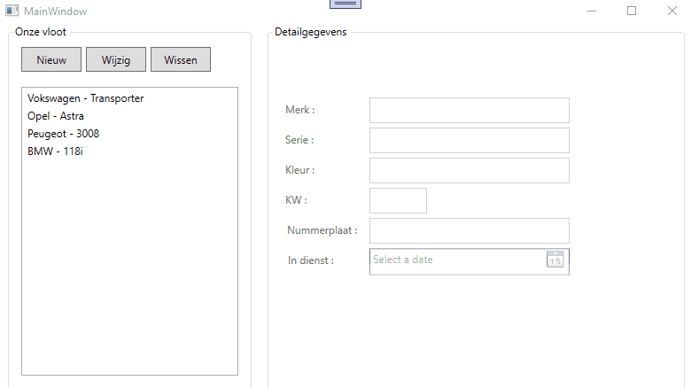

# Oefening hoofdstuk 3 : voertuigen  

## Demo   

    
  
## Bedoeling

We maken een app die de wagens in onze vloot bijhoudt.  
Van elke wagen houden we volgende zaken bij : 
  * Merk : tekst, vereist  
  * Serie : tekst, vereist  
  * Kleur : tekst, vereist 
  * Nummerplaat : tekst, vereist
  * KW : int, moet groter zijn dan 0
  * InDienst : de datum waarop de wagen in dienst werd genomen.  Mag niet null zijn.  Moet kleiner of gelijk zijn aan vandaag   

Het moet mogelijk zijn om : 
  * alle info per wagen af te beelden  
  * een nieuwe wagen toe te voegen  
  * een bestaande wagen te wijzigen  
  * een bestaande wagen te wissen

Uiteraard zorg je er bij de opstart voor dat er een aantal wagens als testgegevens aangemaakt worden.  

Bekijk de demo goed : let er op dat we eventuele fouten nu ook uitgebreid gaan aangeven ! 

## Class Library

Je maakt een Class Library aan met de naam Scala.Oefening03.Core.  
In deze Class Library maak je 2 klassen aan : 
  * **Voertuig** : dit is de blauwdruk van een voertuig (= een entiteitsklasse)
    Voorzie de nodige eigenschappen (zie boven)  
    Voorzie 2 constructors (1 parameterloos, 1 die alle waarden voor de eigenschappen ontvangt)  
    Overschrijf de ToString() methode en toon in de plaats MERK - SERIE (zie demo)  
  * **Vloot** : dit is een service klasse.
    Via deze klasse zorg je er voor dat een List met voertuigen wordt aangeboden.
    Je zorgt er voor dat in de constructor van deze klasse de List gevuld wordt met testgegevens.
    Voorzie een methode om een voertuig object toe te voegen aan de List
    Voorzie een methode om een voertuig object te verwijderen uit de List
    
